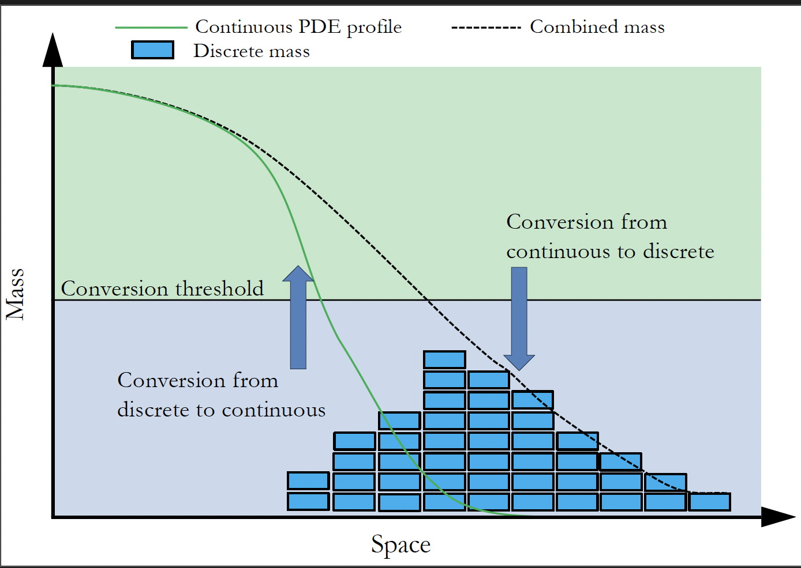

# SRCM Engine

**SRCM Engine** is a Python package for simulating **spatial reaction–diffusion systems**
using a **hybrid stochastic–continuum (SSA–PDE)** framework.

This framework implements the **Spatial Regime Conversion Method (SRCM)**, co-authored by
**Charles Cameron, Prof. Kit Yates, and Dr Cameron Smith**, forming a major component of my PhD research at the University of Bath.

The method allows a system to **dynamically switch between discrete (SSA) and continuous (PDE) representations** across space, depending on local particle density.

For full details, see:

> Cameron, C. G., Smith, C. A., & Yates, C. A. (2025).
> *The Spatial Regime Conversion Method.* Mathematics, 13(21), 3406.
> [https://doi.org/10.3390/math13213406](https://doi.org/10.3390/math13213406)

---



---

## 1. Motivation

Many spatial reaction systems sit awkwardly between two classical modelling approaches:

### Pure SSA

Accurate at low copy numbers, but expensive and noisy at large scales.

### Pure PDE models

Efficient at large scales, but invalid when particle numbers are small.

Hybrid SSA–PDE methods address this by treating some mass discretely and some continuously.
However, existing approaches often require:

* hand-written hybrid propensities
* system-specific derivations
* or deep knowledge of the numerical method

**SRCM Engine removes this barrier** by allowing users to:

1. Write reactions at the *macroscopic* level
2. Define PDE reaction terms in a natural mathematical form
3. Automatically obtain a consistent hybrid SSA–PDE simulation

The goal is to make **hybrid spatial modelling accessible, reproducible, and robust**,
without sacrificing mathematical correctness or performance.

---

## 2. Core Ideas

SRCM Engine is built around the following principles:

### Hybrid Representation

* Each species exists in **both discrete (SSA)** and **continuous (PDE)** forms.
* A **conversion mechanism** dynamically moves mass between the two representations
  using a **two-threshold hysteresis rule**:

  * `DC_threshold` (high): triggers **discrete → continuous**
  * `CD_threshold` (low): triggers **continuous → discrete**

This prevents rapid oscillations between regimes when particle numbers fluctuate near a boundary.

---

### Spatial Structure

* Space is discretised into compartments for SSA.
* Each compartment is internally resolved by a finer PDE grid.
* Diffusion is handled consistently across both representations.

---

### Automatic Hybridisation

* Users specify **macroscopic reactions** (e.g. `A + B → C`).
* SRCM Engine automatically decomposes these into hybrid reaction channels:

  * discrete–discrete
  * discrete–continuous
  * continuous–discrete

This ensures correctness without user intervention.

---

## 3. Package Structure

At a high level, SRCM Engine consists of:

* `HybridModel` — user-facing API for building models
* `SRCMEngine` — core simulation engine
* `HybridReactionSystem` — reaction decomposition and bookkeeping
* `Domain` — spatial domain definition
* `ConversionParams` — hysteresis-based SSA ↔ PDE conversion rules
* `SimulationResults` — structured output and analysis tools

Most users will only interact with **`HybridModel`**.

---

## 4. Installation

```bash
git clone https://github.com/your-org/srcm-engine.git
cd srcm-engine
pip install -e .
```

### Requirements

* Python ≥ 3.9
* NumPy
* Matplotlib
* Joblib (for parallel execution)

---

## 5. Quick Start Example

We simulate a simple reversible reaction:

$$
A \rightleftharpoons B
$$

with spatial diffusion and hybrid dynamics.

---

### 5.1 Build the Model

```python
import numpy as np
from srcm_engine.core import HybridModel

m = HybridModel(species=["A", "B"])

m.domain(
    L=10.0,
    K=40,
    pde_multiple=8,
    boundary="zero-flux",
)

m.diffusion(A=0.1, B=0.1)

# Hysteresis-based conversion
m.conversion(
    DC_threshold=6,
    CD_threshold=4,
    rate=1.0,
)

m.reaction_terms(
    lambda A, B, r: (
        r["beta"] * B - r["alpha"] * A,
        r["alpha"] * A - r["beta"] * B,
    )
)

m.add_reaction({"A": 1}, {"B": 1}, rate_name="alpha")
m.add_reaction({"B": 1}, {"A": 1}, rate_name="beta")

m.build(rates={"alpha": 0.01, "beta": 0.01})
```

---

### 5.2 Initial Conditions

```python
K = m.domain_obj.K
n_pde = m.domain_obj.n_pde

init_ssa = np.zeros((2, K), dtype=int)
init_pde = np.zeros((2, n_pde), dtype=float)

init_ssa[0, :K//4] = 10
init_ssa[1, 3*K//4:] = 10
```

---

### 5.3 Run the Simulation

```python
res = m.run_repeats(
    init_ssa,
    init_pde,
    time=30.0,
    dt=0.006,
    repeats=100,
    parallel=True,
)
```

---

## 6. Parallel Execution

SRCM Engine supports parallel ensemble simulation using multiple CPU cores.

```python
res = m.run_repeats(
    init_ssa,
    init_pde,
    time=30.0,
    dt=0.006,
    repeats=100,
    parallel=True,
    n_jobs=-1,
)
```

---

## 7. Saving Results and Metadata

```python
from srcm_engine.results.io import save_npz

meta = m.metadata()
meta.update({
    "total_time": 30.0,
    "dt": 0.006,
    "repeats": 100,
})

save_npz(res, "ab_switch_mean.npz", meta=meta)
```

### Metadata includes:

* domain parameters
* diffusion coefficients
* conversion settings (**DC_threshold, CD_threshold, rate**)
* reaction rates
* hybrid reaction labels

This ensures simulations are **fully reproducible**.

---

## 7.5 Saving Final-State Ensembles

```python
final_ssa, final_pde, t_final = m.run_repeats_final(
    init_ssa,
    init_pde,
    time=30.0,
    dt=0.006,
    repeats=100,
    seed=0,
    parallel=True,
    n_jobs=-1,
    save_path="ab_switch_final_frames.npz",
)
```

Useful for:

* distributional analysis
* stochastic variability
* large ensemble studies

---

## 8. Visualisation

### Inline Animation (Jupyter)

```python
from IPython.display import HTML, display
from srcm_engine.animation_util import AnimationConfig, animate_results

cfg = AnimationConfig(
    stride=20,
    interval_ms=25,
    title="Hybrid Simulation: A ⇌ B",
)

anim = animate_results(res, cfg=cfg, return_animation=True)
display(HTML(anim.to_jshtml()))
```

---

### Time Series

```python
from srcm_engine.animation_util import plot_mass_time_series
plot_mass_time_series(res)
```

---

## 9. Reaction System Introspection

```python
m.describe_reactions()
```

Displays:

* macroscopic reactions
* hybrid decompositions
* propensities and state updates

Useful for debugging and verification.

---

## 10. When Should I Use SRCM Engine?

SRCM Engine is well suited for:

* pattern formation (e.g. Turing systems)
* ecological or biochemical models
* systems with strong spatial heterogeneity
* problems requiring both stochasticity and efficiency

---

## 11. Limitations

Current limitations include:

* reactions of order > 2 not supported
* 1D spatial domains only
* explicit PDE time stepping

---

## 12. Citation

If you use SRCM Engine:

> Cameron, C. (2026).
> *SRCM Engine: A hybrid stochastic–continuum framework.*

> Cameron, C. G., Smith, C. A., & Yates, C. A. (2025).
> *The Spatial Regime Conversion Method.*

---

## 13. Contributing

Contributions welcome:

* higher-order reactions
* adaptive domains
* GPU acceleration
* improved visualisation

Open an issue or PR.
